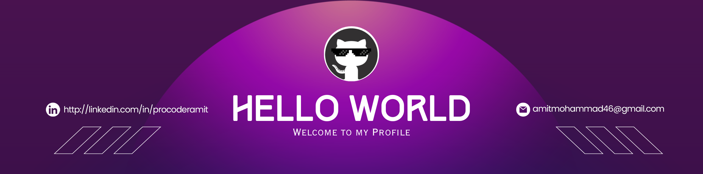
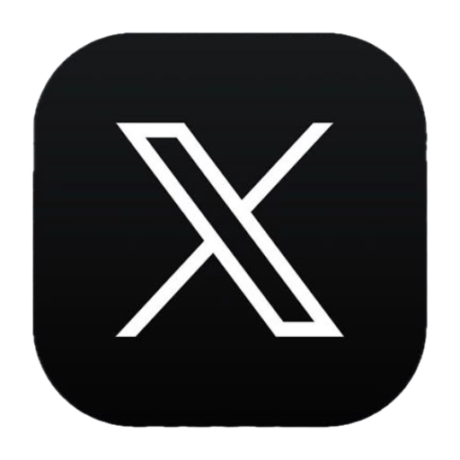

<!--Banner-->

<!--Night Owl image-->

  

<!--Header Name-->

#  𝓘'𝓜 𝓐𝓶𝓲𝓽!

_Full Stack Developer_
 

<!--Start Intro-->

Building scalable and user-focused web applications with Next.js, Express.js, Node.js, JavaScript, TypeScript, WordPress, WooCommerce, Postgres, MongoDB and MySQL. 

- ✨ Student of life :)
- 🌱 I believe every day is an opportunity to learn and improve.
- 💻 Passionate about Web Development, WordPress, and Modern JavaScript ecosystems.
- 🚀 Currently exploring scalable applications with Next.js & Express.js.
- 🛒 Experienced in building eCommerce solutions using WooCommerce.
- 📚 Continuously learning new technologies and development best practices.
- 🎯 Always ready to take on new challenges and impactful projects.
<!--End Intro-->

<!--Profile Count Badge-->
<!-- 

  

 -->

---

<!--Languages and Tools Section-->
<h2 align="center">Tᴇᴄʜ sᴛᴀᴄᴋ</h2> 
<picture>
  <source media="(prefers-color-scheme: dark)" srcset="./Skills_Animation_Dark.gif">
  <source media="(prefers-color-scheme: light)" srcset="./Skills_Animation_White.gif">
  
</picture>
 

<!--Contribution Graph-->
<h2 align="center">📈 Cᴏɴᴛʀɪʙᴜᴛɪᴏɴ Gʀᴀᴘʜ 📈</h2>

    

---

<!--Dynamic Quote card updates everyday at 12 PM-->
<h2 align="center">🌟 Tʜᴏᴜɢʜᴛ ᴏғ ᴛʜᴇ Dᴀʏ 🌟</h2>

<!--STARTS_HERE_QUOTE_CARD-->

    

<!--ENDS_HERE_QUOTE_CARD-->

<!--Contact Section-->

<h2 align="center">🤝 Cᴏɴɴᴇᴄᴛ Wɪᴛʜ Mᴇ 🤝 </h2>

 

<!--Footer-->

  

